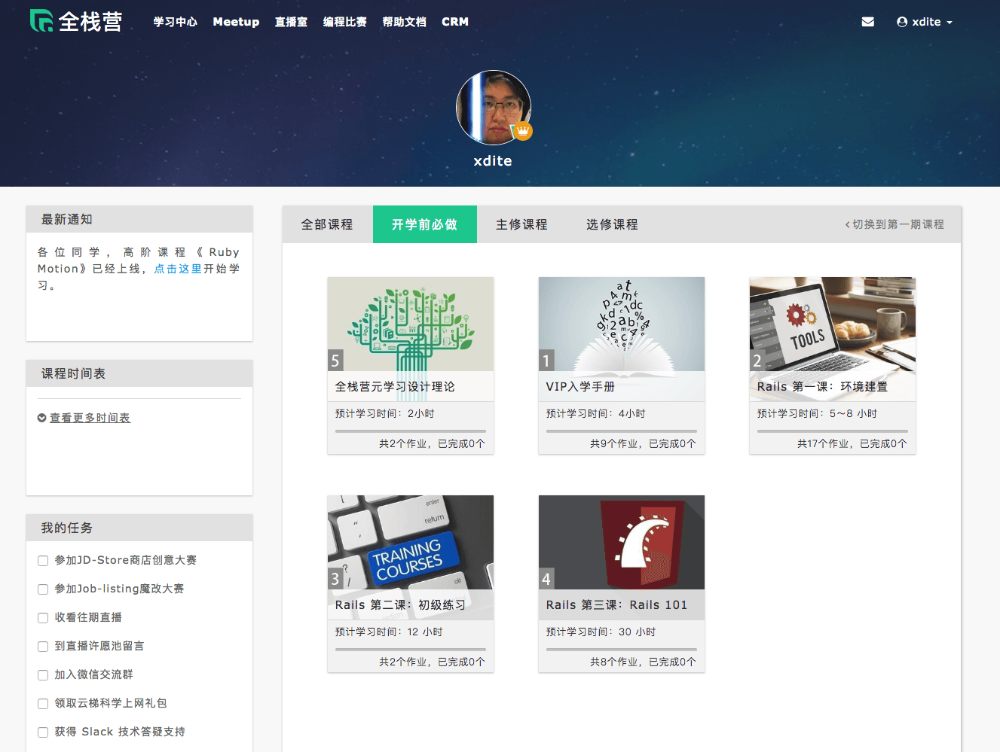
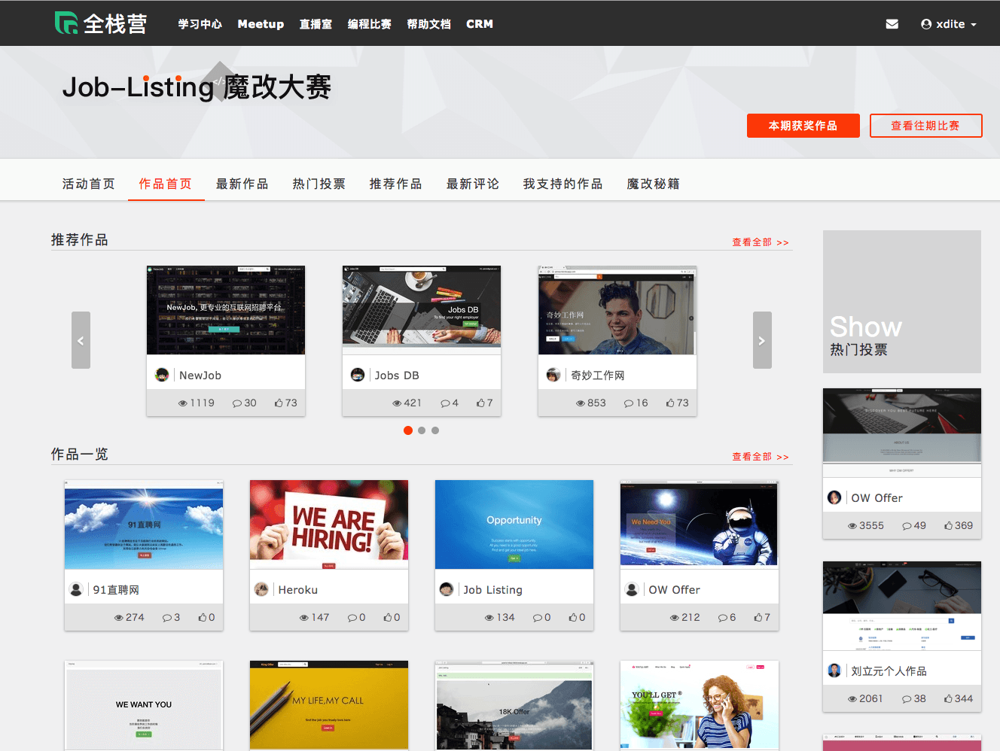
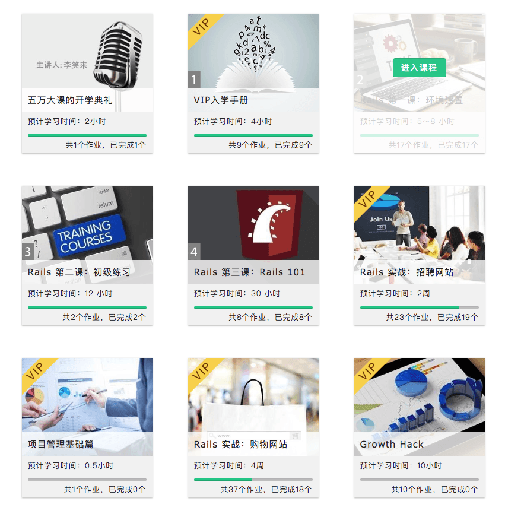
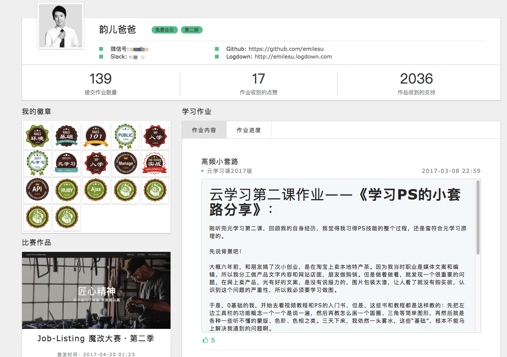
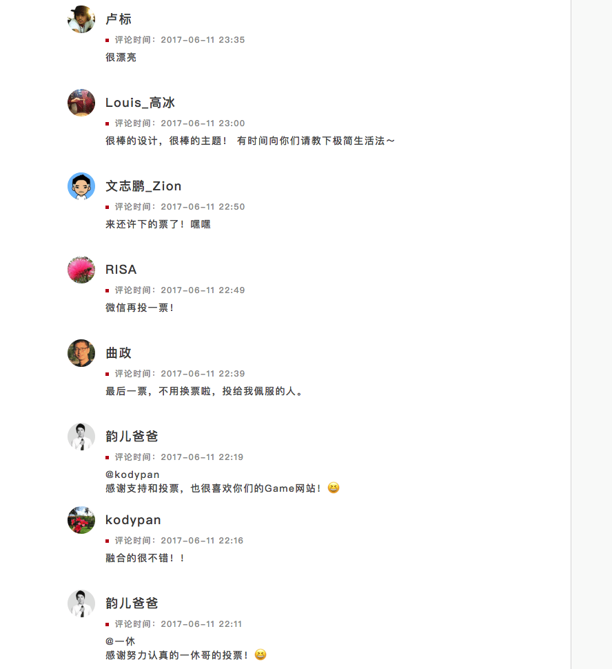

# 第五章  高留存课堂的结构设计（三）

两天型的课程与两个月型的课程，设计的方式是很不一样的。

两天在线下班能教完练完的东西，多半是工作用技能。这类的课程设计比较像是在两天里面带你走完一小套的套路，学会一个核心流程型知识，以及一小群概念知识。

这类课程著重在让学生在两天内收获满满，只要能让学生两天内愉悦的上到最后，并且的确能产出可见的技能取得，就 OK 了。其实写写分镜稿设计一下，也能跑出个 80 分左右的成绩，用不上重兵器。

比较困难的是两个月型的职业养成班。因为两个月是一个相对较漫长的学习过程。而且学生会因各式各样的原因掉队放弃。所以需要用特殊的结构设计。

我认为在做课的时候，要先能够 picture 出，产出什么具体成果的学生，是前期规划最重要的事。以此为蓝图，去设计课程的长度与体裁。

## 有问题的不是留存率，而是你的课程体裁

我常看靠坊间的网课，很多都是老师想讲，然后强迫学生听的课程。这类课程有可能是 7 天、14 天、21 天训练营（而且是连续21天的课）。采用打卡制。

这一类网课为什么留存率低？

曾经有个同行作教育的朋友，跟我抱怨它们 21 天的网课留存率很低。而且 21 天后，留存下来的人，转化去上高阶更贵课的人，比例更低。他让我教教怎么改善。

我直接跟他说。你先想想时间多到 21 天都能天天来你打卡的人是什么人。他时间能多到来每天晚上正事不干来听网课跟你学习，肯定他时间超级便宜才能天天跟你耗。

这样的人多半是没什么经济能力的学生。那么你又想劝他来报你高价班。你这不逻辑错乱吗？

他恍然大悟。

所以重点都不是在网课的内容怎么设计拉高留存率。而是你的体裁与 TA 有问题。

有的网课打著 200 RMB做 7 天 , 14 天的训练营。留存率为什么很低?

我这里帮忙你算一笔帐阿。假设一般一个上进的文员。他想要来报训练营。学费假设 200。但他每个小时工资是 60（60*8*22=10560 RMB/月）。

那么他来上你的一个课的成本其实是 200 RMB + 7*60 = 620。还可以接受。但是如果是 14 天（假设每天都是上一小时）的话是 1040。那么这时候可能就会很多人放弃了。更不用说 21 天的成本是 1460 RMB了。

学费也许低。但是时间成本非常的高。高到学生无法承受。

这与课程如何调整变有趣提升留存度，一点关系都没有。

学生来报课，内心潜意识自己都会算一把帐。报课的人多半是希望花钱节省时间，而不是花钱来被老师浪费时间。

## 大魔王、小魔王、教学关卡

如果你的课程是属于职业养成类。真的很长。我会建议你这样打散设计。比如说做 8 周、6 周、4 周、3 周训练营。

一个礼拜大约放出 1-2 小时长度的课程内容。学生再花2-3个小时去练习。我认为这才是学生有可能接受的长度与强度。

网课还有一个硬限制，是每个课程不应该超过 5 分钟可以学习完毕。所以 1 小时是 12 节。加上学生暂停下来做作业的时间。其实 12 节的内容就已经够多了。

再来，因为 3-8 周是时间很长的跨度。而且通常因为是远距。所以课程如果只是平淡的上课写作业。学生是不可能有动力完整跟完整个课程的。

这时候，这种训练营的体裁，就会要设计的像是游戏了。你要提高这种训练营的留存率、学成率。要从燃起学生的内在学习永动机开始。

一般来说。我会倒著回来设计。先去想大魔王是什么，再设计小魔王是什么，再倒推回去，教学关卡是什么。

像我当初在做全栈营时。这门课程的目的是要将不懂编程的新手，直接带到中等阶级的开发者，能够独立开发商业网站。

全栈营总共有 8 周的时间。于是我们时间是这样安排的。1 周教学关卡，2.5 周准备攻打小魔王。4.5 周准备攻打大魔王。

### 大魔王

学生的毕业目标肯定是要能够独立开发商业网站，学会与他人协作。所以我们的毕业挑战，就直接设定为从无到有，能够做一个商店。

学生能够开出整个网路商店的企划规格。按部就班做完。装潢整个网路商店，并且客制出课上没教的独特功能。

而且这个作品还是需要课上两个同学组队共同完成。

### 小魔王

为了到达能够打败大魔王的程度。

小魔王定位在能够按照老师给的论坛程式范本。改装成独特的样式，并且实验课上教过的 90% 以上的插件效果。

### 教学关卡

在这段过程中。老师著重于设计与介绍一些简单的工具与作业。让同学能够轻易的就完成一些看似很难的程式效果。让学生在熟悉基本工具时，同时建立起强烈的自信心。

先划分出每一个阶段的难度与目标。我们再把想教的知识剪辑进去。

而不是从最基础，叠加课程与课时上去，最后变成失控的四不像。

## 游戏业界如何设计一套游戏

戏业界在设计游戏时。会将游戏会分成四个阶段 -- Discovery => Onboarding => Scaffolding => The Endgame。

游戏设计师会在游戏设计中遵循这样的设计套路。确保玩家在这个过程中，逐渐养成对游戏的摸索，习惯，甚至上瘾。确保每秒钟都沈浸在这个游戏里面。80% 以上好玩的游戏都伴随著这个套路。

Actionable Gamification 游戏化实战作者 Yu-kai Chou 在他其中的一篇博文 "Onboarding Experience Phase in Gamification" 具体拆解了这个过程。

一般的设计流程是：

在游戏 Onboarding 阶段。游戏会在这个阶段植入一个 Epic Calling （使命召唤），让玩家明确知道游戏的目的是什么。 比如餐厅类时间管理游戏，玩家的使命就是开一间牛逼的餐厅，餐厅可以准时上菜。比如说狙击游戏，玩家的使命就是成为二战里面战役的传奇狙击手。

接著在前几个章节，透过一系列的小的教学关卡，让玩家了解核心玩法，养成「游戏里面具体的操作习惯」。

并且透过小成就，让玩家取得第一次的 ah-ha moment（小胜利）。

以狙击游戏来说，就是在第一章的关卡，会透过一些小系列的事件触发，让玩家学习怎么跑步，低蹲，埋伏，进入掩体，瞄准射击刺杀。然后在第一关的尾端，安排一个难度比较低的大 boss　让玩家尝试刺杀，让玩家觉得自己当狙击手，真是超有天赋！

而后在后面的过程中，玩家会逐渐体会到自己有明确的升级。并且会投入心力培养培养自己的角色。而后引入稀缺这个元素（搜集宝物）。

以狙击游戏来说，在游戏进行过程中，玩家学会闯关后，下一步的精力，会花时间在培养自己的角色，针对自己擅长的打法，去升级属性，升级枪枝。调整自己身上背的枪 SET，改装枪的零件，提高射速与子弹携带数量。

然后，在闯关过程中，无意中会找到一些稀有宝物，以及触发一些徽章。有一些玩家甚至于执著在不断的重玩，以取得金牌奖章。

当中，不断出现的意外惊奇，也会掀起玩家的挑战与好奇心。

最后，游戏在最后面，还会提供「社交分享」的元素。玩家可以社群网路上分享自己的击杀视频，以及分享自己的徽章截图。享受来自朋友的崇拜。

这就是为什么玩家在游戏里面沉迷到不可自拔的原因。

玩家在游戏里面可以体会到自己随著技能熟练度不断成长。对于下一个挑战有著高度的期盼。并且每学会一项新技能，或每闯过一个新关卡，都会得到令人惊喜的奖励。

玩游戏是一个越来越开心的过程，谁说学习不能做成这样呢？

## 全栈营是怎么打造的

2017 年。我曾经打造过全世界最大的程式在线学习 Codecamp「全栈营」。这个项目在最后结课时，全程跟完课的学生高达 70%，上课的学生背景都是无计算机背景的小白。

这个 codecamp，时长总共 2 个月。很多学生对于自己能撑过两个月，甚至还对编程上瘾，感到无比神奇。

让我来拆解全栈营是怎么做到这一点的。

###
### STEP 1: 目的 --- 史诗意义与使命感 Epic Meaning & Calling

在报名课程之前，我就将这次学习的目标订为「脱胎换骨成为下一个想要的自己」。明确定义，此次学习目标，是有办法在一年内练成有办法自己结合原有兴趣并动手实做产品的全栈工程师。

### STEP 2: 游戏玩法 --- Routine

在课程的一开始前三周，我们设计了几个教学关卡，让学生掌握写网站的基本几个套路。在这个阶段，学生已经有办法搭起一个简单的论坛成果。

###
### STEP 3: 第一个小胜利 --- Ah-ha Moment

然后紧接著，我们举办了第一次的线上开发大赛。请学生利用前三周的学习，改版成一个有特色的招聘网站。

这个招聘网站的实做难度并不高。难度在于使用者多增添一些特色功能与装潢自己的网站。

能够做成这件事让学生感受到自己也是有能力的

###
### STEP 4: 技能进步 --- 进步与成就感 Development & Accomplishment

在这个过程中，学生可以感受到自己的学习进度。

###
### STEP 5 & 6: 角色养成 --- 所有权与拥有感 Ownership & Possession & 独特的宝箱奖章 --- 稀缺性与渴望 Scarcity & Impatience

在上课的过程中，参与课程的作业进度，缴交的作业，收获的奖章，参赛的作品，都会收录在个人主页上。

###
### STEP 7 & STEP 8 惊喜的关卡 --- 未知性与好奇心 Unpredictability & Curiosity & 体验社交分享 --- 社交影响与关联性 Social Influence & Relatedness

全栈营一期总共有两次大赛。一次是 Job Listing 大赛，一次是 JDStore 大赛。比赛主要是在挑战：

* 如何拆分任务以及与队友偕同合作
* 代码实做能力（Github 原码公开）
* 产品完成度
* 人气度

这个大赛促成了几件我们意想不到的的结果：

* 同学们互相观摩 Github 原始码，互相进行功能上的学习
* 同学们在论坛上，互相分享教程文章，指导其他同学加功能，顺便为自己的作品拉票
* 互相在作品页面上留言打气
* 学员在拉票与竞赛的过程中，互相吸收到陌生人与亲友的打气与帮忙。充满惊奇与收获。许多同学甚至上班请假橹代码，就为了能专注赢的大赛

## 全栈营学员感想

在第一期全栈营结课后，我收到大约 94 份感想。节录 4 份收录在下面：

###
#### 参与全栈学习这么久，你觉得自己和之前最大的不同是？

1. 对任何新领域新知识的学习，再不惧怕，且有比较明确的方式，通过不断做小产品，不会通过埋头坑基础知识来消耗自己的意志力与对新领域的兴趣与好奇心，而是主要以做小东西，让自己开心为目的，不断前行，及时在听到很多牛人前调基础知识的重要性，我也决定要在保持自己内在战斗力和兴趣的前提下，去学基础知识。
2. 解bug的过程中，英文阅读能力有巨大进步，且萌生了想练英语口语，去国外工作的冲动。
3. 彻底淘汰了过去的垃圾学习方法
4. 发现世界好大，好美丽
###
#### 参与全栈学习这么久，你觉得自己和之前最大的不同是？

在全栈学习中逐渐习惯了，将自己知道的写成技术文档，在这个过程中就是再一次的知识提取。从你以为你明白了，到你真的明白了。以及肌肉记忆到底是个什么鬼，也终于明白了一些。

最大的不同在于不明白的地方不在过于着急了！也逐渐从有问题问“度娘”，变成了问谷歌。突然感觉世界一下子清楚了不少！

需要学习的东西还有很多 不可能学完就能被外界认可，我们需要再完善自己所欠缺的部分，后端如一些更基础的内容，前端如html,css,js。希望全栈营的老师们能推出更多优质的教程

###
#### 参与全栈学习这么久，你觉得自己和之前最大的不同是？

1. 做事前会提前做计划，并且预留百分之三十的时间。另外会在行动前盘点好手头资源，每次只做一件事情。
2. 完成比完美重要！不去追求做事的完美，完成第一版之后迅速上线，获得反馈，用迭代的方法逐步完善作品。
3. 用作品说话！网上的交往作品就是你的名片，因为没有其他的方法去判断你，所以如果想让别人认可你，那就用作品去打动他。
4. 学会与人协作！网络让我们可以与世界各地的人建立联系，要做一个好的队友，不要做猪队友，1➕1的效用远远大于2，因为协作会激发每个人的创造性，让协作体中的每个人变得更好。
###
#### 参与全栈学习这么久，你觉得自己和之前最大的不同是？

发现“努力做的比上次好”是一件不容易的事情，但是跨国这段不适期，为了更好一些一点点的前进后，整个人都神清气爽了。会有小伙伴主动来加你，其实是对我的现阶段作品的一种肯定。

虽然不一定帮的上他，但是不害怕说“有什么想要从我作品中学到的效果，尽管问哦！”，能在别人有需求的时候成功帮别人解决，会得到很大的成就感。只是不能每次都迅速跨越。

比以前更坦然的面对自己的无知，并愿意跟别人坦然讲出自己的短板，讲出来后，心理上的压力会小很多，而且多数情况下会有下一步的思路或得到解决。我获得了“把自己的不足”讲出来的勇气。
