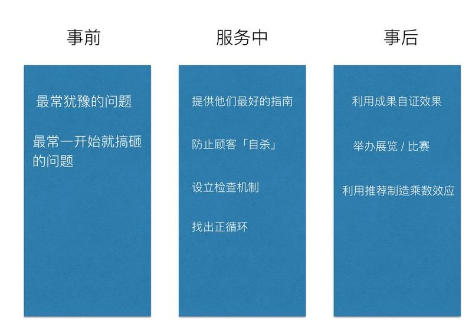

# 第六章  高留存课堂的留存框架

全栈营能够创造出这么高的完课率有几个原因：

* 课程平稳的难度
* 近似游戏的关卡难度设计
* 源源不觉得外在内在牵引
* 让使用者进入心流状态，并且对学习上瘾

这本书的后半段，我们就要来谈如何控制控制课程的难度以及动力的牵引。

## 将增长黑客技术移植到线上教学：Onboarding

学生上课程与用互联网产品一样。常常就会像付款失败的购物车，因为一些莫名奇妙的问题在学习期间卡关，最后就辍学了。

我开设全栈营前，曾经是硅谷产品的技术负责人。专长是产品架构、体验设计、增长黑客。我后来自学摸索出了一套做产品体验的框架，能够大大消除这种莫名其妙卡关的情形。

在创办全栈营时，我不仅将游戏设计引入课程设计，还将产品体验设计也融入到营队的体验设计上。其实课程也是一种「教育产品」，为何我不能将产品上的体验思维也整合进来呢？

而教育产品最大的挑战，往往来自于最后学生的留存率。

一般而言，我们觉得学生撑不到最后，可能是课程教材难度问题，或者可能是学生学习能力问题，或者是没有学到当初想学的东西。

但，真的是这样吗？

我举产品界的例子来说吧。2014 年，我曾经看过硅谷一份由 Hubspot 发表的有关于增长黑客研究文章。它们针对了不愿意续用该产品的客户，做出了一份调查报告

这份报告总结了，客户为什么会停止使用它们的产品的原因：

* 30% 人离开，是因为不懂得如何使用
* 30% 人离开，是因为没有体会到当初宣称的价值
* 10% 是因为产品做得烂
* 10% 人是因为其他竞争者比较好

这份数据的发表，大大颠覆了当时业界对于消费者流失的常识。

我们往往以为消费者离开，是因为自己产品做的不好，或者是别人的产品比较好。但其实背后的原因却不是这样的。

用户离开真实的原因却是这样的：绝大多数客户放弃使用，不再光临，完全是因为「不会用使用，从而感到没有价值」离开的。

我们将这个结论平移到教育界，假设课程也是一个产品的话。也就是「学生根本不懂使用这个课，所以学生感到这个课程没有价值，放弃继续学习」。

## 「让使用者学会使用，从而感到有价值」的快速框架 -- Onboarding

「让使用者学会使用，从而感到有价值」。这件事说起来容易，做起来不容易。

还好。这套框架在教育界没有。但是在产品界已经有了。不仅如此，产品界甚至还更加的能做到甚至让消费者「重复建立起消费习惯，并期待每一次的消费享受」。如果这一套能移植到学习上该有多好。

The Membership Economy 一书整理出了这个流程。

### 步骤一：去除障碍

* 加入会员（免费试用或定期续约）：尽可能让流程顺畅无碍
* 欢迎入会：确保顾客知道签约内容并感谢它们加入
### 步骤二：立即传递价值

* 立即参与：
    * 提供提供初始价值（一首歌，一个礼物，一项事实）。
    * 从一个「游戏」开始（游戏化），鼓励会员做出理想行为
    * 跟社群里的其他会员互动
* 请顾客回馈意见：
    * 入会第一周透过电话，电邮或拦截式访堂
    * 准备好耐心倾听会员的意见
* 提供回馈：
    * 让新进会员知道，它们如何影响其他会员，譬如：时间，参与，人口统计资料
    * 可能的话，指出各位会员的独特优势
### 步骤三：奖励期望行为

* 要求推荐：鼓励会员在入会30天内，邀请其他朋友试用
* 利用数据分析开始提供客制化体验：
    * 将独特要素融入体验，展现对会员的肯定
    * 专注于持续改善，而不是重大突破
* 转入到培育计画
    * 持续提供资讯，协助会员将本身体验与连结最适化
    * 以持续一致的方式跟会员沟通

如果你有用过 App。应该会发现这都是 App 的老套路了。

转换成教育版的话，就可以是这样：

### 步骤一：去除障碍

* 简化学习前置步骤，准备一个新手包，简化环境建置。
* 大量使用模版，学生只要照著填就能做出很厉害的作品
### 步骤二：马上提供服务

* 学生照著教程作出作品后，发现自己是天才，原来从前学不会，只是因为跟错老师。因此更加的督促自己紧跟进度
* 学生要是学习掉队了，利用课程作业系统，找出调队者，利用同学小组或助教，救回进度。
### 步骤三：奖励期望行为

* 鼓励学生写下自己的学习笔记，看见自己每周明确的学习变化
* 鼓励学生完成学习进度，给予小型学习奖品，更授与学习勋章。
* 鼓励学生挑战终极大赛，激发斗志。拿下大赛大奖。

## 如何在正确的「时间点」正确的「触发或奖励行为」

当然，以上写的都是「可以做」的一些建议手段。但是关键是，如何在「正确的时间点」做上这些事，正确的推学生一把。

这个问题，我在产品界没有找到答案。但我在其他地方找到了答案。

Onboarding 这个字，原始于「HR」行业。指的是新人入职的熟悉阶段。因为每一个公司，招聘一个新人的成本很大。若在入职期间，没有受到公司妥当的安排，很容易就浪费了此前招聘时花的巨大财力与心力。

我在逆向了HR 界几十份Onboarding 的 checklist 以后。找到了一组方法。这套方法是由 8 个问题组成：

1. 在开始前，用户会问你什么问题？
2. 在第一次使用前，用户会忘记做什么会让使用者体验搞砸（最常客诉的点）
3. 用户最常做了什么「正确的事」达到很好的体验？
4. 用户最常做了什么「错误的事」结果收到很糟的体验？
5. 东西售出后，你如何检验它们做了「正确的事」或者是「错误的事」？
6. 顾客如何联络你修正问题？
7. 你怎么做事后补偿的方案？
8. 你希望它们如何事后帮你行销？

然后团队试著回答这八个问题当中的每一个问题。只需要诚实回答。每一个问题至少写 8-10 个答案。通常答案就出来了。

以全栈营为例：答案是这样的

### 用问题找到沈船原因：

#### 1. 在上课前，学生會來問你什麼問題？

* 課前要練習到什麼程度？
* 要准备什么电脑？
* 环境要怎么装？
####
#### 2. 在上课第一天，同学忘记做什么会让使用者体验搞砸（最常客诉的点）

* 忘記裝環境
* 根本沒有把 Ruby on Rails 開發環境 build 起來。光裝機就超燒時間
* 学生家里网速非常慢，或者是用了非常烂的「科学上网帐号」
* 使用错误的方法学编程，导致学习进度缓慢
* 自己独立学习，卡住没人救
####
#### 3. 顾客最常做了什么“正确的事”达到很好的体验？

* 按照老师的正确指导，练习，且重复复习
* 有预习，按时交功课
* 每天写 ORID （自我反省）
* 有参与或组织 Meetup
####
#### 4. 学生最常做了什么“错误的事”结果收到很糟的体验？

* 不按照老师的正确指导，按照自己以前学习的步骤学编程
* 最后一天才写功课
* 不写 ORID （自我反省）
* 不纪录「错的」经验
* 不敢问助教
* 不去问 Meetup
####
#### 5. 东西卖出后你如何检验他们做了正确的事”或“做了错误的事”？

* 利用交作业系统确保同学学习的方向正确
* 鼓励同学写作 ORID （自我反省），以及整理小常识
* 多多举办群分享
#### 6. 他们如何联络你修正问题

* 线上对话（Intercom 系统）
* 教材吐槽机制
* 助教定期回报
####
#### 7. 你怎么做事后补偿的方案？（有 FAQ / 说明书 / 部落格 / 客服专线 ）

* 线上额外的教程
* 根据学习的效果，每周举办两次 Live 讲座补强
* 助教辅导，线下 Meetup
* 留级机制
####
#### 8. 你希望他们如何事后帮你行销？

* 参加大赛，学习成果自证
* 拉票也会感染到周遭其他人
* 推坑朋友
* 上其他分享群里面分享方法
* 整理学习心得发表
### 根据「事前」「服务中」「事后」三个阶段补强服务

我们再把产品的旅程分成三阶段：事前，服务中与事后。

####
#### 阶段一：事前

根据这些问题我们发现学生，在「上课前」（准备阶段）时会有一些疑问：

* 課前要練習到什麼程度？
* 要准备什么电脑？
* 环境要怎么装？

所以我们做了这样的安排：

* 课程前设立了一个欢迎课程
    * 具体叙述要去哪里买电脑
    * 详细的安装环境指南
    * 以及有明确的验收标准

而且当他们装环境后，会卡住的人普遍有这些情形：

* 忘記裝環境
* 根本沒有把 Ruby on Rails 開發環境 build 起來。光裝機就超燒時間
* 学生家里网速非常慢，或者是用了非常烂的「科学上网帐号」
* 使用错误的方法学编程，导致学习进度缓慢
* 自己独立学习，卡住没人救

所以我们在欢迎课程里面，多做了两件事：

* 赠送每位同学高品质的「科学上网」（VPN）服务
* 提醒同学可以加入 Slack （学习聊天群组），找助教聊天
* 鼓励同学组织地区 Meetup 互助学习
####
#### 阶段二：服务中：

我们在上这些课的时候，发现在这门课表现杰出的同学。与过去背景是否有学过编程没有太大的正相关。有些时候，甚至没有学过编程的同学，学习速度比学过编程的人还要高，甚至成果更好。

我们发现表现比较好的同学：

* 按照老师的正确指导，练习，且重复复习
* 有预习，按时交功课
* 每天写 ORID （自我反省）
* 有参与或组织 Meetup

表现很差的同学有这样的特征：

* 不按照老师的正确指导，按照自己以前学习的步骤学编程
* 最后一天才写功课
* 不写 ORID （自我反省）
* 不纪录「错的」经验
* 不敢问助教
* 不去问 Meetup

所以我们改善的作法是：

* 开学第一天就设立「放下你的无效学习」，并要同学承诺
* 设立多个微信群组，以及多线助教
* 使用交作业系统，确保学生进度有跟上轨道。发现交作业死限三天前，还没有交的人，陆续提醒。
* 不断安利写 ORID （自我反省）的好处
* 把自我反省与纪录，当作是作业的一环去要求同学
* 利用同侪学习证明「正确学习」的威力
* 展示学长姐过去的学习纪录，证明按照正确的步骤走，能够有很大的学习效果。最终起了非常好的示范效果

课程每一周上新，但是有时候同学会被当周难度卡住，或者上面教材有错，会让同学卡住

* 开放教材系统的吐槽评论。让先卡住的同学第一时间就能会报 bug。
* 一旦在上面发现同学反应难度太高，就立刻上线补充教材
* 要求值班助教每天回报同学常见卡住的问题。

也会

* 利用交作业系统确保同学学习的方向正确
* 鼓励同学写作 ORID （自我反省），以及整理小常识
* 多多举办群分享

观察他们使用的状况。随时调整上课进度与难度

####
#### 阶段三：事后

我们从追踪的情况。发现只靠教材是不足够的。有时候学生想要多问一些其他问题，或者学习强度太高，挫折感提升。

我们每周会

* 根据学习的效果，每周举办两次 Live 讲座补强
* 额外多录线上额外的教程

实在不行，就

* 单独助教辅导，请他们参与线下 Meetup

再不行，就启动

* 留级机制

至于如何激励同学，并且展示成果？

我们在整个课程当中，设计了两次程式比赛。鼓励同学参赛。比赛是以上课作业为蓝本。扩充以及装潢成自己的参赛作品。

在这个过程中，会鼓动学生的竞争意识。提高学习意愿。在参加比赛时，因为获选标准，需要同学互相投票。同学会撰写教程指南，分享在课程论坛上。希望同学看完教程之后，能够投票回报作为感谢。

于是比赛时，优秀教程也满天飞，促进下一轮的正向循环。同时，为了拉票，他们也会在其他非课程微信群上，向自己的亲朋好友拉票。

在比赛结束后，我们也鼓励同学针对这次大赛，写下自己的学习心得。

* 参加大赛，学习成果自证
* 拉票也会感染到周遭其他人
* 推坑朋友
* 上其他分享群里面分享方法
* 整理学习心得发表

如此一个课程循环下来。一个同学至少会写 30-50 篇的学习心得以及纪录。有几百个同学同时上课。会产生出成千上万篇的学习纪录与分享。

我们不仅可以监视到学生的学习效果，并且也在营销上达到非常好的效果展示。

基本上我们团队，在打造整套课程，或者是推出一个新的小课程时。都会用这个框架先自我检视一遍。经过了这道打磨，留存率往往就可以拉高不少。
