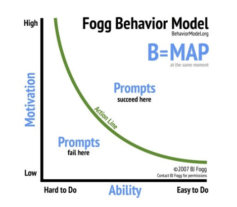
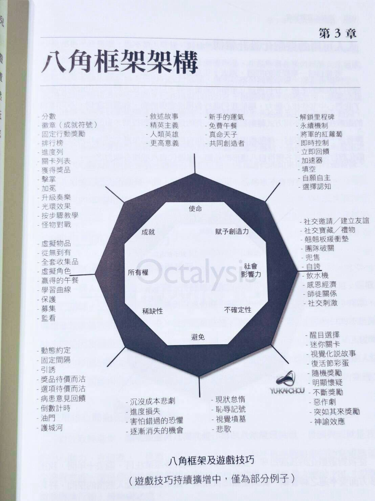
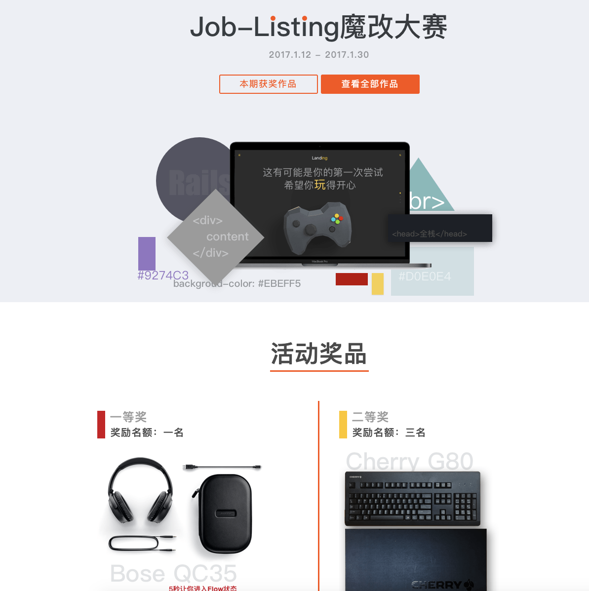
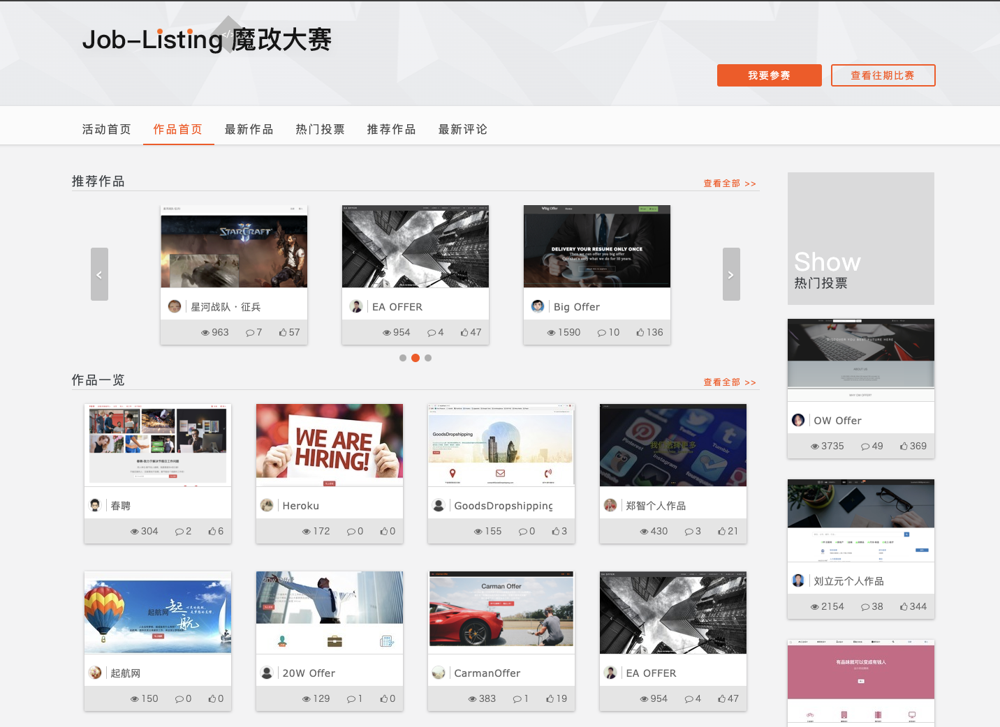
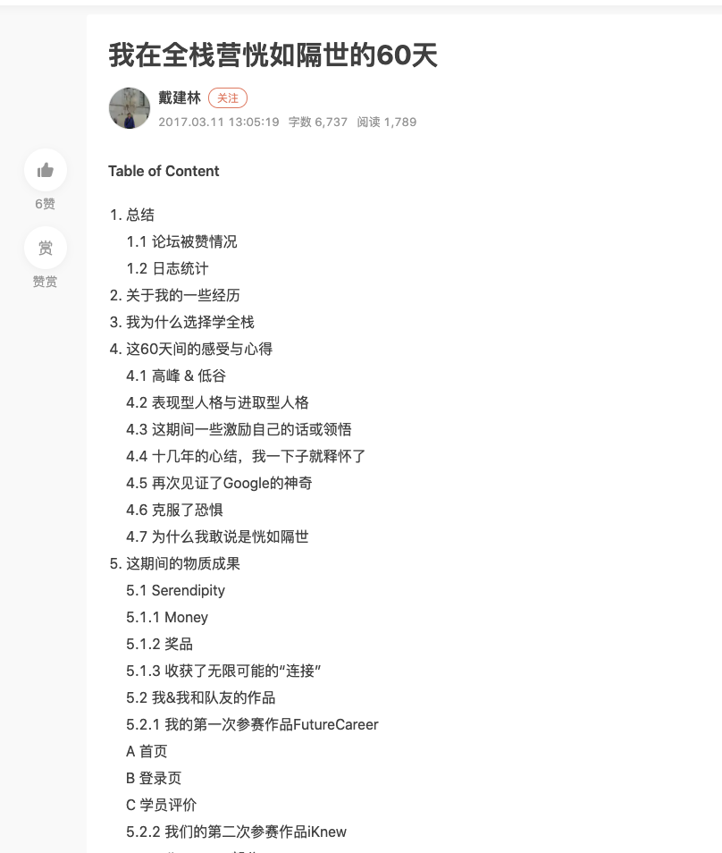

# 第九章　课程设计实战（一）

耶鲁大学的 B.J. Fogg 2009 发表了一篇论文，总结了如何从设计上提高转化率，其关键是Motivation-Ability-Trigger（动机-能力-触发)（后 Trigger 改为 Prompts ）。

提到

做为学生。不去行动的理由有千百种。但是总归原因下来大底是两条：

* 动机不够
* 门槛太高
## 八角框架助力你一把（提高动机）

还记得我们前一章提到的八角框架图吗？

这张图之所以十分重要。是因为这张图综合了几乎所有人类底层的动力机制。

高留存课堂的建构，完全基于三个要素

* 足够强的动机，让学生愿意踏出第一步产生行动
* 足够简单的步骤，让学生没有藉口不去行动
* 足够简单的回圈以及持续的回馈奖商，让学生愿意一次再一次的重复回圈。
### 全栈营是怎么打造的

这次，让我们再重新回顾一下我们在第五章提到的内容。

让我来拆解全栈营是怎么做到这一点的。

#### STEP 1: 目的 --- 史诗意义与使命感 Epic Meaning & Calling

全栈营的 Landing Page 口号与其他编程班非常不一样。与其他编程班不一样，来报名编程般的朋友，多半并不是想要就业的工程师，而是已有原先专业，想要多学一门编程技能，协助自己日常生活自动化，过上一把编程瘾的人。

如果我以「就业」作为口号。恐怕很难作为核心动力，去驱动学生。

所以我以「脱胎换骨成为下一个想要的自己」做为核心 Slogan。人生在世，谁不想在这一辈子能有一个机会重新投胎呢？

这是我在课程设下的第一个大动机「赋予史诗意义与使命感」。而这招通常也是课程的一开头，常用的动机。

当然，你也不一定要用「使命」作为第一个原始设定。只是在这个班，「使命」设定比较符合 TA 动机。

* 所有权
* 成就
* 使命√
* 赋予创造力
* 社会影响力
* 不确定性
* 避免
* 稀缺性

比如说在某些就业为主的班级，可能就会比较主打「避免」（不学编程就被时代逃汰）。「稀缺」（你知道 AI 工程师现在在市场上炙手可热吗？）「所有权」（工程师月薪两万人民币起）。

不过以上这三个动力，并不会很持久。因为它们不属于从「内在」出发的核心动力。

#### STEP 2: 游戏玩法 --- Routine

在课程的一开始前三周，我们设计了几个教学关卡，有教学手册（元学习课），增强让学生自学的信心。有基础课程，让学生拥有最基本的拆解需求能力，建构簡單網站的能力。

我们的初级课程本质核心是让学生

* 学会如何将日常生活中遇到的问题，转述成程序员说的自然语言（需求规格）
* 学会备开发动态网站的能力。转述成程序员说的机械语言（程式码）

我们尽量让学生用日常生活中的例子。去练习写「程序员说的自然语言」。比如说如何对「出门上班到公司」这一段路程要做的事，做优先权排列。

动态网站开发的核心是 CRUD（增删找查）。我们在这一段安排了至少两遍以上的循环。让学生对这个动作到达手指熟练的程度。

这一段的关卡。完成之后，学生能够非常简单的搭起一个有模有样的简单论坛。因为几乎来上课的很多学生，这辈子从来没碰过编程。而在完成前面短短的练习，就能盖出一个论坛。

学生成就感自然就容易爆棚。

基本上我们的课程自始至终微绕著1. 拆需求 2. 不同形式的 CRUD 变形关 3. 整合第三方 API 做出更有模有样的网站功能。

###
#### STEP 3: 第一个小胜利 --- Ah-ha Moment

上面这一段的课程是三周。

三周以后。我们举办了第一次的线上开发大赛：请学生利用前三周的学习，自己改版成一个有特色的招聘网站。

这次的大赛，难度并不高。基本上学生完全可以直接拿课程的作业直接修改参赛。

这一步主要是让学生能看到自己学习的成果。

然而，如果只是「道德劝说」让学生修改课程作业，改成自己版本的网站。这样「动机」实在太薄弱了。

所以我们祭出了大狠招。

1. 奖品 （稀缺 / 所有权）

丰厚的奖品。一等奖赠一支 QC 35 耳机（价值 2000 元 RMB）二等奖 Cherry 键盘（价值 1000 RMB）

2. 投票（社交）

作品除了技术性评分外，也有投票评分。许多同学为了要赢的奖项。到处去亲朋好友间帮忙投票。而亲朋好友看到了，无不称赞它们进步惊人

3. 低门槛

这次的大赛。基本上都不需要自己是个尖子生才能参加。最低门槛，你拿个过去「作业的官方阳春解答」，都能拿来魔改装潢。

完全没有藉口不参加。

#### STEP 4: 技能进步 --- 进步与成就感 Development & Accomplishment

我们的课程系统。每一个课程都切成极小的作业。并设有进度条。

学生可以从他自己的学习 Dashboard，确切感受到自己的学习进度进度在前进，成果在累积。

此外我们的学习作业里面包含了让学生每天写的 ORID 学习成长日志。学生是真的能看到自己不断的在逐步成长。

#### STEP 5 & 6: 角色养成 --- 所有权与拥有感 Ownership & Possession & 独特的宝箱奖章 --- 稀缺性与渴望 Scarcity & Impatience

另外。在游戏设计时，很重要的一个元素 Agency （代入感）。

我们在系统内，将每个学生，参与课程的作业进度，缴交的作业，收获的奖章，参赛的作品，都会收录在个人主页上。

每完成一个基础要求，就会多一个奖章。学生会不由自主的想要去建设自己的主页。完成一个又一个的成就。

###
#### STEP 7 & STEP 8 惊喜的关卡 --- 未知性与好奇心 Unpredictability & Curiosity & 体验社交分享 --- 社交影响与关联性 Social Influence & Relatedness

全栈营一期总共有两次大赛。一次是 Job Listing 大赛，一次是 JDStore 大赛。

一般来说，社会上对于合格程序员的考核有四大要素。

* 拿到需求，正确的拆分成规格
* 按照规格，实际实做出来
* 与人协作，完成进度
* 根据实际生活中的变化找到资源，并且整合进作品内

我们第二次大赛。本身也是基于后四周的教材（一个电商）。

只不过这次电商网站大赛。本身较为复杂。除了改版商店外，另有加分题（需要完成三个不在讲义上的功能）。并且，在第一次大赛时，是单人作品。第二次是双人作品。

我们把整个学习目标融合在整个大赛之中。

同时也对整个大赛祭出了高额奖品。

第一名的 Aeron （程序员效率神气）本身就价值约 13000 RMB。这堂课学费也就是 12000 RMB 左右。如果能得奖，甚至是买椅子送课程了。第二名的 ipad Pro 当时也大约要价 8000 RMB 左右。

奖品威力非常惊人。

这个大赛的设计主要是在挑战学生的以下能力：

* 如何拆分任务以及与队友偕同合作
* 代码实做技术能力（Github 原码公开）
* 产品完成度，修饰打磨的功夫
* 人气度，与同学社交互助的能力

这个大赛促成了几件我们意想不到的的结果：

* 同学们互相观摩 Github 原始码，互相进行功能上的学习
* 同学们在论坛上，互相分享教程文章，指导其他同学加功能，顺便为自己的作品拉票
* 互相在作品页面上留言打气
* 学员在拉票与竞赛的过程中，互相吸收到陌生人与亲友的打气与帮忙。充满惊奇与收获。许多同学甚至上班请假橹代码，就为了能专注赢的大赛

不仅仅只是做为学校方，对产生的化学效应，惊喜连连。就连学生自己，也没有想到来上一堂编程课可以收获这么多意外与惊喜。

## 如何降低挫折与困难

还记得我们第六章的 Onboarding Framework 吗？我们用了八个问题，去把核心的「困难点」找出来。

1. 在开始前，用户会问你什么问题？
2. 在第一次使用前，用户会忘记做什么会让使用者体验搞砸（最常客诉的点）
3. 用户最常做了什么「正确的事」达到很好的体验？
4. 用户最常做了什么「错误的事」结果收到很糟的体验？
5. 东西售出后，你如何检验它们做了「正确的事」或者是「错误的事」？
6. 顾客如何联络你修正问题？
7. 你怎么做事后补偿的方案？
8. 你希望它们如何事后帮你行销？

我们发现学生在学前的关卡在于：

* 学编程前没有 Mac 电脑
* 在正式开始学之前，就对于自己学成「没有信心」
* 上课时没有留足够多的时间做练习
* 开学前没有做准备的作业，结果直接跟不上
* 没有科学上网工具，关键的自救方法无法实施
* 不知道怎么正确的问题
* 之前用了错误的方法学编程
1. 预备了课前课，「元学习课」

我在开设全栈营前，有开设了一门「元学习课」，这门课是教导一般人怎么样正确学习以及自学。里面用了一些非编程的例子。展示了学习并不是我们之前想得那么困难。

学习之所以困难，是因为用错方法，学错观念。错误的观念比如是：

* 学习如同登山，从基础学起
* 学习要从理论学起，从实做学起是偷懒不扎实的
* 学习要刻苦练习
* 一般人是不可能真的学会编程这么难的技能

我用了一些手段让学生展示这些都是「错误」的江湖传说。只要用对方法，那些门槛瞬间就跨过去了。学习也可以很轻松有趣，并且充满激情。

设计这门编程课之所以辛苦。应该是没有一门学问的学生，90% 在学习之前会催眠自己一定学不会。

2. 预备了编程前导课

我们设计了一个编程前导课。让学生将环境先行建置起来。毕竟开学时就会直接教编程了。

因为装环境时，有一些软件需要翻墙下载。为了怕学生买到无效的科学上网软件。于是我们联系了可靠的软件厂商。一口气采购了五百套赠送给学生。保证一定翻得过。

另外，装环境时，最怕自己无法 debug。于是我们也组建了学习群与课前助教，如果真的遇到问题。会有排班助教帮忙排解，或者是可以在线下找到同城同学互相排解。

3. 特殊的上课时段

就我教过那么多届学生。我发现学生学不会最大的问题，在于没有机会进行练习。而没有机会进行练习的原因是因为不会安排时间。

与其他编程课习惯的开课时间（六、日）不一样。

我多年来坚持在周一开课。即便线下班也是周一的晚上六点半到九点半。

这样安排的好处在于，从这个礼拜一到下个礼拜一。学生至少有周间的晚上与周末两整天可以学习。我们在礼拜二礼拜四有助教举办的线下辅导聚会。如果真的不会写，可以带到课上写。

周末也有满满的时间可以练习。

但是如果学生选在周末时间上课的话，因为周间很忙，所以学生会给自己很多藉口，不练习。

那这样一点意义都没有了。

4. 特殊的课程格式

全栈营编程课的教材文本，与其他编程课是完全不一样的。我们是采用「纯文字」+ 「画面」。而其他编程课是采视频。

这一点非常特别。其实我们也可以选择使用视频，但是我们却选择了不用。

这是因为连我自己在上其他领域的视频课时，也觉得视频课上课非常麻烦。一方面，虽然觉得老师拍视频直播写代码，非常有诚意。但**学习时却是非常的麻烦。必须要不断的按暂停，一个字一个字跟著老师敲。而最讨厌的，甚至还是跟著打，还会打错字**。

要知道我在学另外一门学问，如 iOS 时，可能也是新手。有错误发生我根本也不懂 debug。

学习一节 10 分钟小小的内容。我可能也要花上 30-40 的分钟，还**搞的自己筋疲力竭，充满挫折感**。

所以，虽然「用文本上课」非常**政治不正确**。还会引来「让学生贴 code」的骂名。

但是我们还是会坚持这样让学生这样做。甚至我们会鼓励学生 a) 先照著 code 贴一遍 b ) 自己再跟著教材打一遍 c) 放掉教材自己打一遍 d) 如果三遍还不熟，就练五六遍。

目的就是要让学生搞明白流程，并且从贴代码改代码的流程中，有机会知道自己错在哪里。更重要的是，**走错路还能爬回来**。

此外。因为我们的「预编教材」是文字撰写的。所以如果遇到教材有错字 bug、流程上不顺，或者难度太高。我们更换教材的成本是很低的。

我们通常是周一晚上释放教材。有学生（大约 5% 的学生）在周二下午前就会写完，并且反馈回来。我们看到马上就会修改。到周二晚上时，bug 已经几乎不见。其馀 95 % 的学生根本不知道有 bug 曾经存在过。

但是如果是视频课程。这样做的难度就很大了。

5. 大量的助教

全栈营课上采取大量的助教助练。这些助教几乎都是我在业界的朋友以及过去的学生。而且是有薪任职。自学编程或远端学编程最大的难点，在于遇到问题时，没有人愿意「耐心」的听你「说完」，并「通灵」找到你现在遇到的 bug，「手把手」教你排除。

课上我们预备了两轮助教，基本上从下午 14:00 到 22:00，都可以找到助教帮忙排解问题。

此外，因为学编程时，大量的学生连「用正确格式」问问题都做不到。（如连错误画面都是截的小小一面，只说「发生了错误」，助教根本无法错误的通灵）

我们甚至还释出了「如何正确的问技术问题」指南。

6. 线下的 Meetup

全栈营在线下版时，有线下同城的 Meetup。这是因为我当时在台北也有 host 关于写 Rails 的聚会。所以我（付费）拜托一些同行与徒弟，帮忙辅导学生。鼓励学生带著作业，来 Meetup 写。

一方面强制让大家划出时间。有时间写作业，学习课程之外的小知识。

同时在这个 meetup ，我们也可以比较容易掌握到同学在学习上的进度。

而在线上版的时候，因为全国大约 500 名学生。我们鼓励同城的组成 Meetup。这样学习领先的可以带著学习落后的同学一起冲刺。

而且学生学习时较不会孤单。同时身为群主的同学，在一般同学学习遇到困难时，也会主动关怀，去把同学捞回来。降低很多半途放弃的概率。

7. 可「参考」的作业系统

全栈营的作业系统，是自己订制的。交完作业后，单章课程下会出现「自己的作业」以及「别人交的作业」。学生是可以参考同学的解答的。

这样设计的原因是因为我们上课不在乎学生有没有抄别人的作业。毕竟学习是为了自己的学习。作业是自己练习的成果。

我们的作业分。「基本题」与「加分题」。基本题是课上教的，加分题是要自己google尝试解出来的。

如果真的题目做不出来，有时候看别人与自己的作业结果，更能比较出解题的差异。学到更多课堂外没有的知识。
